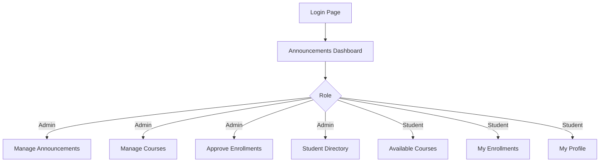
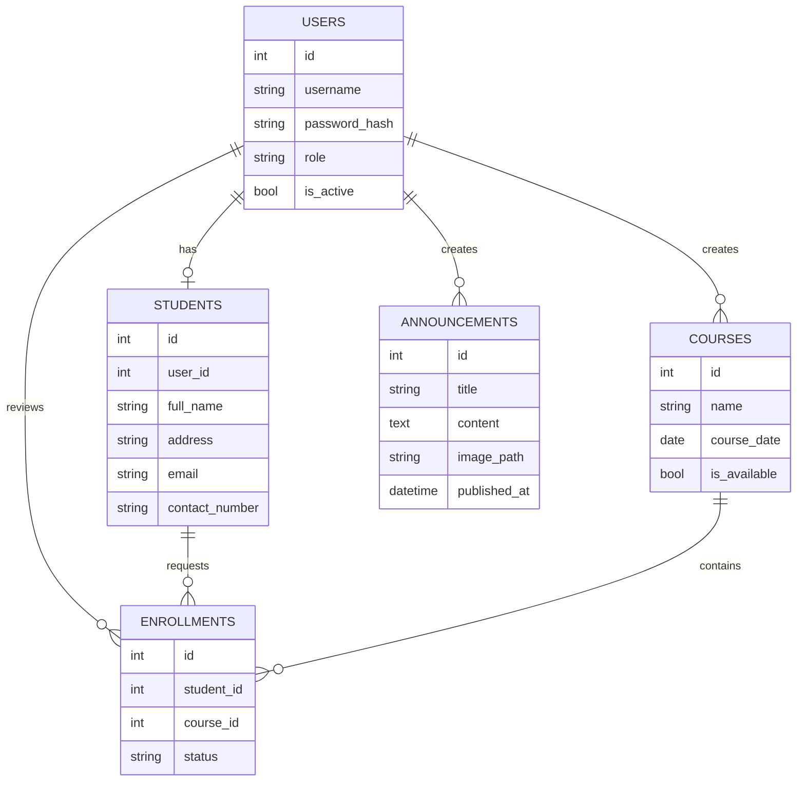
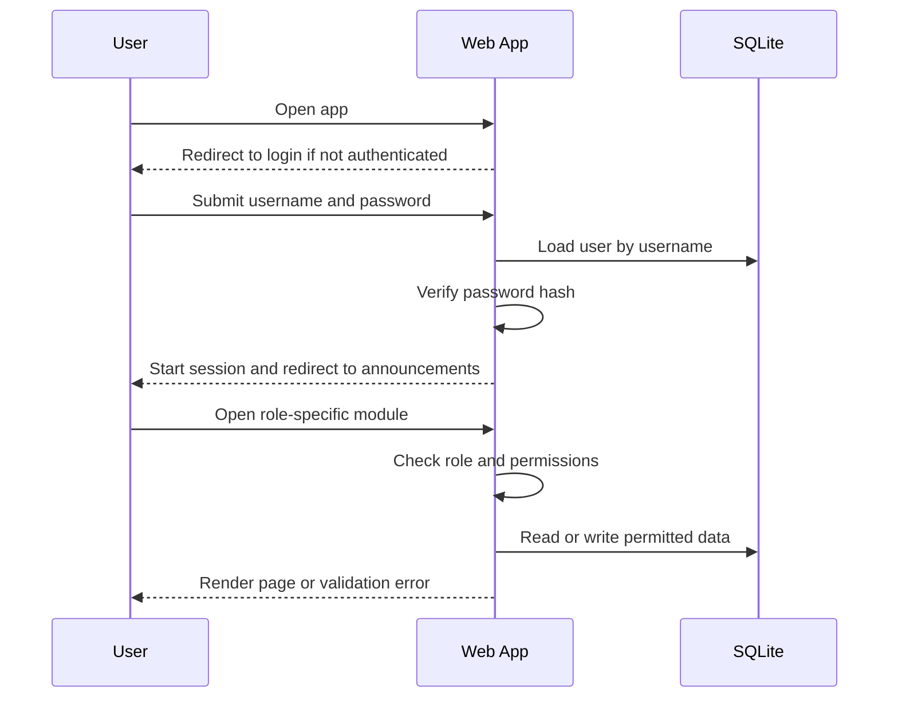
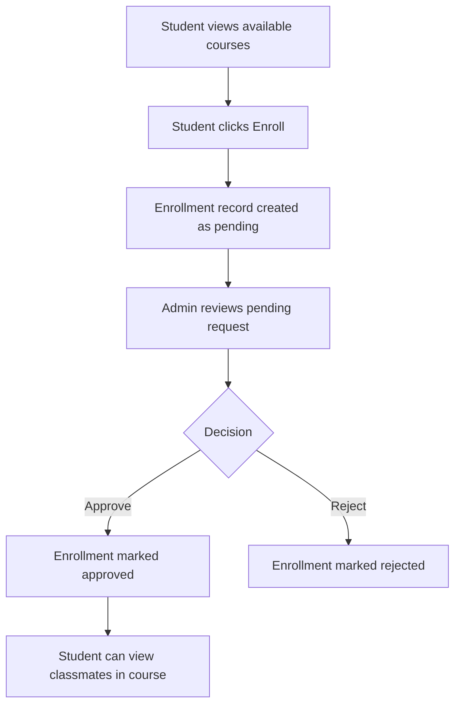

# Student Registration Web App Implementation Plan

Date: 2026-05-27

## 1. Goal

Build a Python and SQLite web application for a professional academy with:

- authenticated access for all users
- two roles: `admin` and `student`
- announcements as the first page after login
- course browsing and enrollment workflow
- admin approval of student enrollments
- secure handling of user credentials
- support for announcement image uploads

The UI should feel professional, academic, and operationally clear.

## 2. Recommended Technical Stack

Use a lightweight server-rendered architecture to keep the app maintainable and secure.

- Backend framework: `Flask`
- Database: `SQLite`
- ORM: `SQLAlchemy`
- Forms and CSRF: `Flask-WTF`
- Authentication session handling: `Flask-Login`
- Password hashing: `Werkzeug` password hashing helpers
- Migrations: `Flask-Migrate` or a lightweight schema bootstrap script
- Templates: `Jinja2`
- Styling: custom CSS with a disciplined design system
- File uploads: local filesystem storage under `uploads/announcements/`

## 3. High-Level Architecture

The application should follow a clean layered structure.

```text
+---------------------------+
| Browser                   |
| Login, dashboard, forms   |
+-------------+-------------+
              |
              v
+---------------------------+
| Flask Routes / Blueprints |
| auth, dashboard, admin,   |
| students, courses         |
+-------------+-------------+
              |
              v
+---------------------------+
| Service Layer             |
| auth service              |
| enrollment service        |
| announcement service      |
| course service            |
+-------------+-------------+
              |
              v
+---------------------------+
| Data Layer                |
| SQLAlchemy models         |
| SQLite database           |
+---------------------------+
```

## 4. Role and Permission Model

### Admin

- log in
- view announcements dashboard
- create, edit, and publish announcements
- upload announcement images
- create and manage courses
- view student roster per course
- approve or reject enrollment requests
- view list of all students

### Student

- log in
- view announcements dashboard
- view only currently available courses
- request enrollment into a course
- view own enrolled courses
- see names of other students in the same approved course
- view own profile details

## 5. User Experience Direction

The UI should align with a professional academy instead of a generic admin panel.

- Color system: navy, slate, ivory, muted gold or teal accent
- Typography: dignified headings with highly readable body text
- Layout: clear top bar, left navigation for desktop, compact mobile navigation
- Landing after login: announcement bulletin with images, dates, and highlighted notices
- Forms: strong labels, concise validation messages, no ambiguous controls
- Tables: readable row spacing, status badges, explicit actions
- Empty states: clear instructional text when there are no courses or announcements

## 6. Core Screens

### Shared

- login page
- announcements dashboard
- user menu / logout

### Admin screens

- announcement list
- create announcement
- course list
- create course
- enrollment approvals
- student directory
- course detail with enrolled students

### Student screens

- available courses
- enrolled courses
- course detail with classmate list
- profile view

## 7. Navigation Map



## 8. Data Model

### Tables

#### `users`

- `id`
- `username` unique
- `password_hash`
- `role` enum-like text: `admin` or `student`
- `created_at`
- `last_login_at`
- `is_active`

#### `students`

- `id`
- `user_id` foreign key to `users`
- `full_name`
- `address`
- `email` unique
- `contact_number`
- `created_at`

#### `courses`

- `id`
- `name`
- `course_date`
- `is_available`
- `created_by_user_id`
- `created_at`
- `updated_at`

#### `enrollments`

- `id`
- `student_id`
- `course_id`
- `status` values: `pending`, `approved`, `rejected`
- `requested_at`
- `reviewed_at`
- `reviewed_by_user_id`

#### `announcements`

- `id`
- `title`
- `content`
- `image_path` nullable
- `published_at`
- `created_by_user_id`
- `created_at`
- `updated_at`

### Entity Relationship Diagram



## 9. Request and Access Flow



## 10. Enrollment Workflow



## 11. Security Plan

Even though the requirement says simple username and password, the implementation should still avoid common mistakes.

- Store passwords only as salted hashes, never plaintext
- Use server-side session management
- Protect all POST routes with CSRF tokens
- Validate and sanitize uploaded files
- Restrict uploads to image MIME types and safe extensions
- Generate unique filenames for uploads
- Enforce role-based authorization checks on every admin route
- Prevent duplicate enrollments for the same student and course
- Validate user input at form and model boundaries
- Avoid raw SQL string interpolation for user inputs
- Set secure session configuration
- Return generic login failure messages

## 12. Proposed Project Structure

```text
student-registration/
├── app.py
├── config.py
├── requirements.txt
├── instance/
│   └── app.db
├── uploads/
│   └── announcements/
├── app/
│   ├── __init__.py
│   ├── extensions.py
│   ├── models.py
│   ├── auth/
│   │   ├── routes.py
│   │   └── forms.py
│   ├── main/
│   │   └── routes.py
│   ├── admin/
│   │   ├── routes.py
│   │   └── forms.py
│   ├── student/
│   │   ├── routes.py
│   │   └── forms.py
│   ├── services/
│   │   ├── auth_service.py
│   │   ├── announcement_service.py
│   │   ├── course_service.py
│   │   └── enrollment_service.py
│   ├── templates/
│   └── static/
│       ├── css/
│       └── uploads/
└── implementation-plan.md
```

## 13. Delivery Phases

### Phase 1: Foundation

- initialize Flask app factory
- configure SQLite and extensions
- create base layout and design tokens
- define models and bootstrap schema

### Phase 2: Authentication

- build login and logout
- seed initial admin account
- enforce login-required behavior
- redirect authenticated users to announcements

### Phase 3: Announcements

- admin create announcement form
- image upload handling
- announcement list and dashboard landing page

### Phase 4: Courses and Students

- student profile model and CRUD seed flow
- admin course creation
- student available course listing
- course detail pages

### Phase 5: Enrollment Workflow

- pending enrollment submission
- admin approval and rejection actions
- student enrolled course view
- classmate visibility for approved enrollments only

### Phase 6: Hardening and Polish

- authorization tests
- input validation
- upload validation
- responsive UI refinement
- empty states and flash messages

## 14. Initial Seed Data Plan

Provide a bootstrap command to create:

- one `admin` user
- one or two sample `student` users
- sample courses
- sample announcements

This will make manual testing and UI review much faster.

## 15. Testing Plan

### Automated

- authentication success and failure
- admin-only route protection
- student-only behavior checks
- enrollment approval workflow
- duplicate enrollment prevention
- announcement upload validation

### Manual

- login flow
- announcement-first landing behavior
- admin creates course
- student sees only available courses
- student enrollment request appears as pending
- admin approval changes student view
- classmate names appear only after approval
- image rendering for announcements
- mobile layout sanity check

## 16. Risks and Mitigations

- SQLite concurrency limitations
  - acceptable for a small academy app; keep transactions short
- insecure upload handling
  - mitigate with strict file validation and stored filename randomization
- role bypass bugs
  - centralize authorization checks and test them
- schema drift during iteration
  - use migrations or controlled schema initialization
- UI becoming generic
  - define a visual system up front and implement it consistently

## 17. Build Order Recommendation

Implement in this order:

1. app factory, config, models, extensions
2. login/logout and seeded admin
3. announcements dashboard
4. admin announcements with upload
5. admin course creation
6. student profile and course browsing
7. enrollment request and approval flow
8. tests, validation, UI refinement

## 18. Definition of Done

The app is complete when:

- every page requires authentication
- login redirects to announcements
- admins can create announcements with optional images
- admins can create courses
- students can see currently available courses only
- students can request enrollment
- admins can approve or reject enrollments
- students can see classmates only in approved courses
- password storage uses hashes
- the app runs locally with SQLite and documented setup steps
- the UI feels coherent and professional for an academy setting
